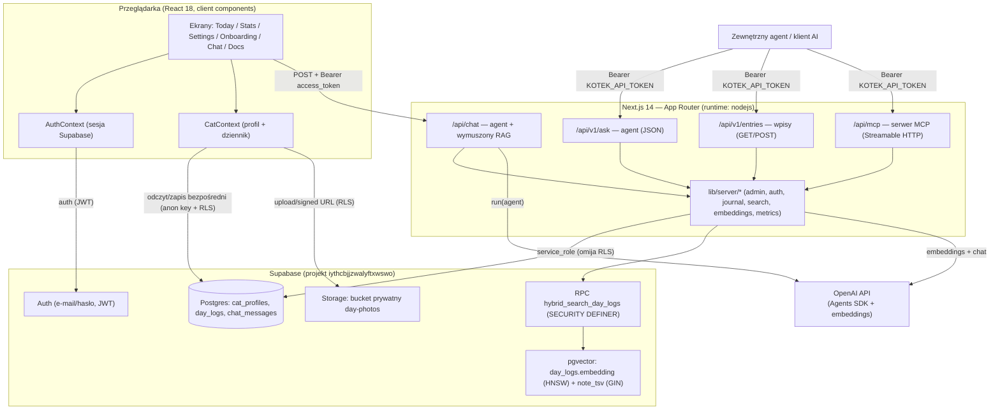

# Architektura — Kotek 🐱

> Dokument wygenerowany na podstawie kodu na ostatnim commicie `main`:
> `d0fee5d feat: zdjęcia dnia + twardsze bezpieczeństwo (RPC, /api/chat, sanityzacja XSS)`
> (repo `https://github.com/ann-24601/kotek.git`, lokalny HEAD = `origin/main`).
> Opis opiera się wyłącznie na plikach w repo. Stwierdzenia niepotwierdzone w kodzie
> oznaczono jako **[do weryfikacji]**.

## Przegląd systemu

Kotek to aplikacja webowa (Next.js 14, App Router) wspierająca opiekuna kota w prowadzeniu
codziennego rytuału (poluj → jedz → myj się → śpij) i obserwacji zmian w zachowaniu.
Użytkownik prowadzi dziennik dnia: cztery metryki (aktywność, apetyt, miauczenie/`vocal`,
zabawa), notatkę (rich-text HTML z TipTap) oraz zdjęcia dnia. Na bazie dziennika działa
**behawiorysta AI** — agent zbudowany na OpenAI Agents SDK, który odpowiada na pytania
opiekuna, korzystając z **wyszukiwania hybrydowego** (wektor + FTS, łączone metodą RRF)
po wpisach dziennika (RAG). Dane są trwale przechowywane w **Supabase** (Postgres + pgvector
+ Storage + Auth). System wystawia też zewnętrzny **REST API v1** oraz **serwer MCP**,
dające agentom AI dostęp do dziennika jako narzędzi.

## Diagram architektury

## Komponenty

| Komponent | Odpowiedzialność | Technologia |
|---|---|---|
| **Frontend / ekrany** (`src/screens/*`, `src/app/*/page.tsx`) | UI: Dziś, Statystyki, Ustawienia, Onboarding, Czat behawiorysty, Docs | Next.js 14 App Router, React 18, TypeScript, Tailwind + shadcn/ui, TipTap (notatki) |
| **AuthContext** (`src/context/AuthContext.tsx`) | Logowanie/rejestracja e-mail+hasło; `getSession()` potwierdzany przez `getUser()` | `@supabase/supabase-js` (klient przeglądarki) |
| **CatContext** (`src/context/CatContext.tsx`) | Stan profilu i dziennika; **bezpośredni** odczyt/zapis do tabel `cat_profiles` i `day_logs` z poziomu przeglądarki | supabase-js (anon key, RLS) |
| **`/api/chat`** (`src/app/api/chat/route.ts`) | Behawiorysta dla zalogowanej osoby; wymuszony pre-retrieval (RAG) + agent z narzędziem `search_diary`. Autoryzacja: JWT sesji (`requireUser`) | OpenAI Agents SDK (`@openai/agents`) |
| **`/api/v1/ask`** (`.../v1/ask/route.ts`) | Pytanie do agenta przez zewnętrzny token; pełny kontekst + historia rozmowy per dzień (`chat_messages`) | OpenAI Agents SDK |
| **`/api/v1/entries`** (`.../v1/entries/route.ts`) | REST: `POST` upsert wpisu, `GET` odczyt wpisu (domyślnie dziś) | Next route handler |
| **`/api/mcp`** (`.../mcp/route.ts`) | Serwer MCP (Streamable HTTP) z narzędziami `add_entry`, `get_entry`, `search_entries` | `mcp-handler`, `@modelcontextprotocol/sdk` |
| **Warstwa serwerowa** (`src/lib/server/*`) | `admin` (klient service_role), `auth` (tokeny/JWT), `journal` (CRUD + kontekst + historia), `search` (hybryda), `embeddings` (OpenAI), `metrics` (walidacja) | TypeScript, supabase-js, fetch |
| **Behaviorist** (`src/lib/behaviorist.ts`) | Budowa instrukcji systemowych agenta z kontekstu (profil + wpisy + retrieved) | TypeScript |
| **PhotoUploader / photos** (`src/components/PhotoUploader.tsx`, `src/lib/photos.ts`) | Upload, usuwanie i podpisane URL-e zdjęć dnia | Supabase Storage (klient) |
| **Sanityzacja** (`src/lib/sanitize.ts`, `src/lib/html.ts`) | Oczyszczanie HTML notatek (XSS) i `stripHtml` przed embeddingiem/FTS | DOMPurify |
| **Skrypt backfill** (`scripts/backfill-embeddings.ts`) | Uzupełnia brakujące embeddingi w `day_logs` (idempotentny, CLI) | tsx, supabase-js, OpenAI |

## Źródła danych

**Supabase Postgres** (projekt `iythcbjjzwalyftxwswo`, wg komentarzy w migracjach):

| Tabela / obiekt | Co przechowuje | Jak odpytywane |
|---|---|---|
| `cat_profiles` | `profile`, `play_profile`, `pillars` (jsonb) per `user_id` | Klient (anon+RLS) z `CatContext`; serwer (`loadContext`) |
| `day_logs` | Wpis dnia: `user_id`, `date`, `metrics` (jsonb), `note` (HTML), `photos` (jsonb), `embedding vector(1536)`, `note_tsv` (generowana), `updated_at`. Unikat `(user_id, date)` | Klient bezpośrednio; serwer `upsertEntry`/`getEntry`; RPC do wyszukiwania |
| `chat_messages` | Historia rozmów per dzień: `user_id`, `date`, `role`, `content`, `created_at` | Serwer (`getDayHistory`, `appendDayMessages`) — używane przez `/api/v1/ask` |
| **pgvector** `day_logs.embedding` | Embedding notatki (OpenAI `text-embedding-3-small`, 1536 wym.); indeks **HNSW** cosine | RPC `hybrid_search_day_logs` (ramię wektorowe) |
| **FTS** `day_logs.note_tsv` | `tsvector` generowany z `f_unaccent(note)`, konfiguracja `'simple'` (brak słownika PL); indeks **GIN** | RPC (ramię keyword, `websearch_to_tsquery`) |
| **RPC** `hybrid_search_day_logs` | Łączy top-N wektor + top-N keyword metodą **RRF** (`p_rrf_k=60`), filtry metryk (jsonb min/max). `SECURITY DEFINER` | `sb.rpc(...)` z `lib/server/search.ts` |
| **Storage** bucket `day-photos` | Prywatny (nie-publiczny), limit 10 MB, tylko obrazy. Ścieżka `{userId}/{date}/{uuid}.{ext}` | Klient: upload + `createSignedUrls` (TTL 1 h) |

**Zewnętrzne API:** OpenAI — embeddingi (`/v1/embeddings`, `text-embedding-3-small`, 1536) oraz
model agenta przez Agents SDK. **[do weryfikacji]** konkretny model czatu agenta nie jest
jawnie ustawiony w kodzie — używany jest domyślny model OpenAI Agents SDK.

## Integracje i połączenia

| Integracja | Kierunek | Uwierzytelnianie (typ) |
|---|---|---|
| Supabase Auth (przeglądarka) | out (klient → Supabase) | e-mail/hasło → JWT sesji (`NEXT_PUBLIC_SUPABASE_ANON_KEY`) |
| Supabase DB/Storage (klient) | out | anon key + **RLS** zawężające do `auth.uid()` |
| Supabase DB (serwer, `lib/server/admin`) | out | `SUPABASE_SERVICE_ROLE_KEY` — **omija RLS**, dlatego każde zapytanie jest jawnie zawężone do `user_id` |
| OpenAI Embeddings | out (serwer → OpenAI) | `OPENAI_API_KEY` (Bearer), wyłącznie serwerowo |
| OpenAI Agents SDK | out (serwer → OpenAI) | `OPENAI_API_KEY` (`setDefaultOpenAIKey`) |
| **`/api/chat`** | in (przeglądarka → serwer) | JWT sesji Supabase w `Authorization: Bearer <access_token>` (`requireUser` → `getUser`) |
| **REST API v1** (`/api/v1/*`) | in (klient zewnętrzny → serwer) | `Authorization: Bearer <KOTEK_API_TOKEN>`, porównanie stałoczasowe; działa na danych `KOTEK_USER_ID` |
| **Serwer MCP** (`/api/mcp`) | in (agent AI → serwer) | ten sam `KOTEK_API_TOKEN` przez `withMcpAuth`; narzędzia `add_entry`, `get_entry`, `search_entries` |

Webhooki, kolejki, cron — **brak** w repo (jedyne zadanie poza-requestowe to ręczny skrypt
`backfill-embeddings.ts`).

### Zmienne środowiskowe (nazwy i rola — bez wartości)

| Zmienna | Rola | Zasięg |
|---|---|---|
| `NEXT_PUBLIC_SUPABASE_URL` | URL projektu Supabase | klient + serwer |
| `NEXT_PUBLIC_SUPABASE_ANON_KEY` | klucz publiczny (RLS) | klient + serwer (weryfikacja JWT) |
| `OPENAI_API_KEY` | embeddingi + agent | **tylko serwer** |
| `SUPABASE_SERVICE_ROLE_KEY` | klucz omijający RLS | **tylko serwer** |
| `KOTEK_USER_ID` | UID właściciela danych dla API v1 / MCP | serwer |
| `KOTEK_API_TOKEN` | Bearer dla API v1 i MCP (rotowalny) | serwer |

## Przepływ danych

**1. Wprowadzanie wpisu (UI):** użytkownik na ekranie *Dziś*/*Ustawienia* edytuje metryki,
notatkę (TipTap, sanityzowaną) i zdjęcia → `CatContext.saveLogs` zapisuje **bezpośrednio**
do `day_logs` przez supabase-js (anon key, RLS po `user_id`). Zdjęcia idą do bucketa
`day-photos` (ścieżka prefiksowana `userId`, wymóg RLS). Embedding notatki na tej ścieżce
**nie** powstaje (zapis klienta nie woła `embedEntryNote`) — patrz Otwarte pytania.

**2. Wpis przez API/MCP:** `POST /api/v1/entries` lub MCP `add_entry` → walidacja metryk
(`validateMetrics`) → `upsertEntry` (service_role) → po zapisie **best-effort** generuje
embedding notatki (`embed` → OpenAI → `update day_logs.embedding`); błąd nie blokuje zapisu.

**3. Rozmowa z behawiorystą (UI, `/api/chat`):**
weryfikacja JWT (`requireUser`) → **wymuszony pre-retrieval**: ostatnie pytanie opiekuna
→ `hybridSearch` (embedding zapytania + FTS → RPC RRF, zawężone do `userId`) → top-8 wpisów
wstrzyknięte w instrukcje agenta → `run(agent)` z dodatkowym narzędziem `search_diary`
(agent może dociągnąć więcej wpisów) → odpowiedź wraca do UI. Retrieval jest best-effort
(błąd nie przerywa rozmowy — agent ma też pełny dziennik w kontekście).

**4. Rozmowa przez API (`/api/v1/ask`):** token → `loadContext` (profil + wszystkie wpisy)
+ `getDayHistory` (wątek dnia z `chat_messages`) → `run(agent)` → odpowiedź zapisywana
parą user/assistant do `chat_messages` (pamięć per dzień).

**Human-in-the-loop:** kluczową bramką jest **człowiek wprowadzający dane** — metryki i
notatki ocenia/wpisuje opiekun (ekran *Dziś*); agent AI tylko czyta dziennik i doradza.
**[do weryfikacji]** brak jawnego mechanizmu zatwierdzania zapisów inicjowanych przez agenta
(narzędzia MCP `add_entry`/API zapisują od razu) — nie ma kroku potwierdzenia przez człowieka
przed zapisem z poziomu agenta.

## Hosting i deployment

- **Framework:** Next.js 14 (App Router). Skrypty: `dev` (`next dev -p 5173`), `build`,
  `start`, `lint`. Trasy API ustawione na `runtime = "nodejs"`.
- **Deploy:** wg `README.md` — **Vercel** (Import projektu, autodetekcja Next.js). Te same
  zmienne środowiskowe trzeba ustawić w Vercel (Production + Preview). **[do weryfikacji]**
  brak `vercel.json` / IaC w repo potwierdzającego konfigurację hostingu.
- **Backend zarządzany:** Supabase (Postgres + pgvector + Storage + Auth), projekt
  `iythcbjjzwalyftxwswo` (z komentarzy w migracjach). Migracje SQL w `supabase/migrations/`
  są **kopiami dla śladu wersjonowania** — zastosowane na projekcie ręcznie/zewnętrznie,
  nie ma w repo śladu CI uruchamiającego `supabase db push`. **[do weryfikacji]**
- **Brak** Dockerfile / docker-compose / tmux / cron w repo.
- **Środowisko dev (lokalne, z notatek projektu):** dev server bywa uruchamiany z lokalnej
  kopii `~/kotek` (Google Drive zbyt wolny do kompilacji webpacka); kanoniczne źródło edycji
  to kopia na Drive. To uwarunkowanie lokalnej maszyny, nie część architektury produktu.

## Otwarte pytania / TODO

- **Spójność embeddingów przy zapisie z UI:** `CatContext` zapisuje `day_logs` bezpośrednio
  przez klienta i **nie** generuje embeddingu (to robi tylko ścieżka serwerowa `upsertEntry`).
  W praktyce notatki dodane przez UI nie trafiają do ramienia wektorowego, dopóki nie
  uruchomi się `backfill-embeddings.ts`. Do potwierdzenia, czy to świadoma decyzja.
- **Model agenta czatu:** nie ustawiony jawnie w kodzie (`new Agent({...})` bez `model`) —
  używany domyślny model OpenAI Agents SDK. Do weryfikacji/ujednolicenia.
- **Pojedynczy właściciel w API/MCP:** API v1 i MCP działają na jednym `KOTEK_USER_ID`
  (aplikacja faktycznie wieloużytkownikowa w UI przez Supabase Auth). Niespójność modelu
  dostępu do weryfikacji — czy API ma kiedyś obsługiwać wielu użytkowników.
- **FTS bez stemmingu PL:** konfiguracja `'simple'` + `f_unaccent` — zapytanie keyword musi
  zawierać token występujący dosłownie w notatce; parafrazy łapie tylko ramię wektorowe.
- **Deployment/migracje jako proces:** brak w repo IaC, pipeline CI/CD i automatyzacji
  aplikowania migracji Supabase — stan faktyczny środowisk do potwierdzenia poza repo.
- **README częściowo nieaktualny:** opisuje zapis w `localStorage` i czat jako „makietę”,
  podczas gdy kod używa Supabase i działającego agenta. Warto zaktualizować.
